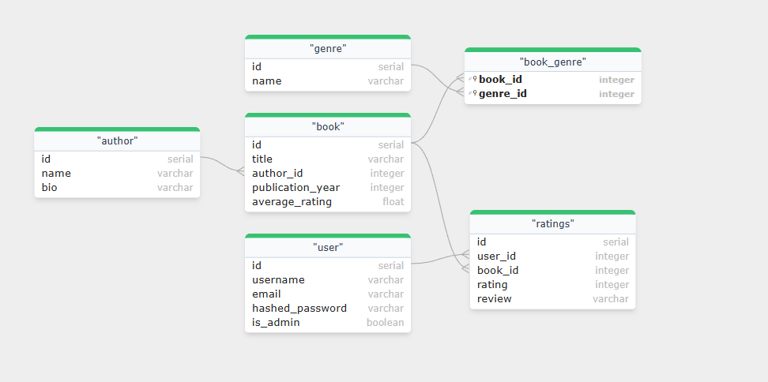

# Book Recommender API

API для рекомендации книг на основе пользовательских оценок с использованием алгоритма коллаборативной фильтрации.

## Основные возможности

- CRUD операции для книг, авторов, жанров и рейтингов
- Аутентификация через JWT токены
- Система рекомендаций на основе косинусного сходства
- Фильтрация книг по автору, жанру и году издания
- Расчет среднего рейтинга книг

## ER-диаграмма



## Запуск проекта

1. **Настройте переменные окружения**:

   Понадобится два файла - `app.env` и `db.env` в директории `env`.
   Для простоты проверки, они были закоммичены в репозиторий (обычно так не делают).

   В `app.env` данные для работы приложения:
    ```
    DB_HOST=localhost
    DB_PORT=5432
    DB_NAME=book_recommender
    DB_USER=backend
    DB_PASS=Salfetka6
    
    ADMIN_EMAIL=admin@example.com
    ADMIN_USER=admin
    ADMIN_PASS=admin
    
    TEST_DB_NAME=book_recommender_test
    
    SECRET_KEY=86bd6eb3dcbeb6b6a8b59fce81f7a4d4ae0d0ae3ae803d302fbb96f41988478c
    ACCESS_TOKEN_EXPIRE_MINUTES=30
    ```

   В `db.env` данные для работы базы данных:
    ```
    POSTGRES_DB=book_recommender
    POSTGRES_USER=dbadmin
    POSTGRES_PASSWORD=Salfetka5
    ```

2. **Запустите контейнер с базой данных**:
   ```bash
   docker-compose up -d db
   ```

3. **Установите зависимости**:
   ```bash
   python -m venv .venv
   . .venv/bin/activate
   pip install -r requirements.txt
   ```

4. **Примените миграции**:
   ```bash
   alembic upgrade head
   ```

5. **Запустите приложение**:
   ```bash
   fastapi run app/main.py
   ```

**Приложение будет доступно по адресу**:

```
http://localhost:8000
```

## Документация API

После запуска проекта документация доступна по адресам:

- Swagger UI: [/docs](http://localhost:8000/docs)

## Тестирование

Установите зависимости:

```bash
pip install pip install pytest pytest-asyncio httpx pytest-cov
```

Для запуска тестов выполните:

```bash
pytest --cov=app --cov-report=term-missing tests/
```

Покрытие тестами: >67%
